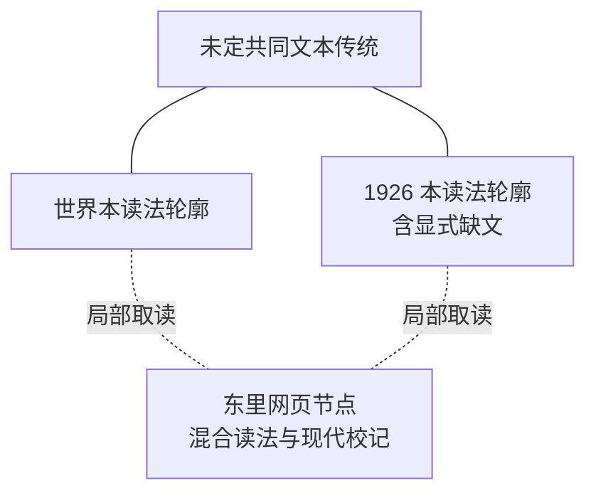
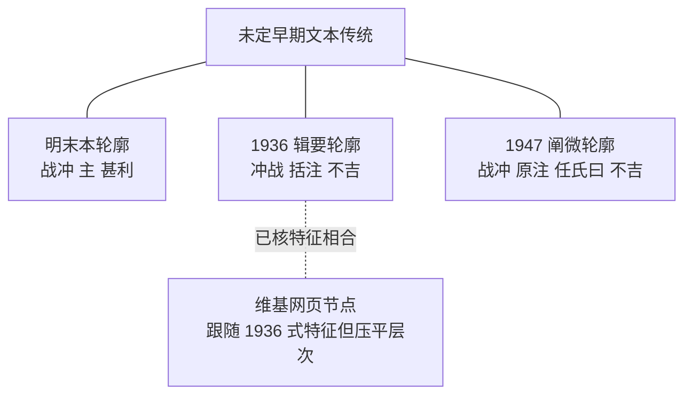

# 八字岁运目标章节版本关系证据矩阵

核验日期：2026-09-26。机器可读矩阵见 [bazi-timing-stemma-matrix.json](bazi-timing-stemma-matrix.json)。结论是：现有证据足以区分《子平真诠》两个扫描读法轮廓、《滴天髓》三个扫描版本轮廓，并识别两个网页节点的编辑性混合或层次压平；不足以建立带方向的父本—子本抄传树，也不足以指定唯一底本。

矩阵以[实质异文校本](bazi-timing-collation.json)、[页级外交转录](bazi-timing-diplomatic-transcription.json)和[逐栏坐标](bazi-timing-column-locators.json)为证据入口。它比较 16 个有明确定位的鉴别特征和 9 组同书两两关系。没有计算“相似度分数”：这些特征本来就是为发现差异而挑选，并非对全书随机抽样，拿相同数除以总数会制造虚假的亲疏精度。

## 《子平真诠》关系轮廓

| 特征 | 世界图书馆本 | 1926 文明书局本 | 东里转录/校记 |
|---|---|---|---|
| 论行运首句 | 配命中八字之喜忌 | 配八字之喜忌 | 同 1926 本 |
| 食带煞例语序 | “运逢印”后接“煞重身轻……” | 同世界本 | 显式移动“身轻” |
| 冲的缓急 | 冲时日则缓 | 冲日时则缓 | 同世界本 |
| 章节结语 | 于外格取运章 | 于各格取运章 | 取“各”，并校记原作“外” |
| 成格变格完整性 | 完整 | “壬生戌下闕”后缺文 | 完整网页转录 |
| 命运二支会局 | 亦作清論 | 亦作清出 | 同世界本 |
| 原局措辞 | 命中原有 | 柱中原有 | 同世界本 |
| 干支发用 | 支以为干之生地 | 支为干之生地 | 同世界本 |

世界本与 1926 本共享章节结构和大量非鉴别段落，但八个已选特征中形成了稳定可见的两组读法信号。1926 本另有明确缺文，所以不能作为“论行运成格变格”的完整底本。

东里节点呈混合状态：首句和“各格”接近 1926 本；冲的词序、“清论”“命中原有”“支以为”接近世界本；同时加入移动语序、显式校记和长按语。它适合检索和发现异文，不能替代任一影印见证。

图中的线只表示局部兼容信号，不表示抄传方向。

## 《滴天髓》关系轮廓

| 特征 | 明末本 | 1936《辑要》 | 1947《阐微》 | 维基文库 |
|---|---|---|---|---|
| 核心词序 | 戰沖 | 衝戰 | 戰沖 | 衝戰 |
| 吾身句 | 主譬如吾身 | 日主譬如吾身 | 日主譬如吾身 | 本矩阵未重新裁字 |
| 层标签 | 早期层未标名 | 正文与括注同页 | 原注、任氏曰分列 | 连续展示，层次压平 |
| 乙庚/子丑括注 | 不见 | 有 | 1947 原注不见 | 有 |
| 喜水判断 | 甚利 | 不吉 | 原注作不吉 | 1936 式不吉分支 |
| 任氏评注与命例 | 不见 | 不见 | 明确存在 | 页面不含 |
| 何谓好例解 | 完整，跨左右叶 | 完整 | 原注完整 | 完整转录 |
| 运降句 | 大。则运自降。吉。 | 运自不得不降。亦保无患。 | 则运自降岁。亦保无患。 | 本矩阵未重新裁字 |

可见关系不是简单的“早本—晚本直线”：

- 明末本与 1947 原注同作“战冲”，且都没有 1936 式两条括注；但二者在“主/日主”“甚利/不吉”和运降句上又分开。
- 1936 与 1947 共享“日主”和“不吉”，但核心词序、括注政策、层标签、任氏层和运降句不同。
- 维基文库在当前已核特征上跟随 1936 式“冲战”、括注和“不吉”，却把来源层连续展示。它可能反映该编辑分支，但现有证据不能裁定依赖方向或具体底本。
- 明末本“何谓好”已经由逐栏证据确认完整，不能再用此前错误的“喜阴则中断”支持任何版本关系判断。

同样，图中没有父子箭头；三个扫描版本均保留独立分歧，不能从出版年代直接推成文字继承链。

## 两两关系结论

| 关系 | 可确认 | 不能确认 |
|---|---|---|
| 世界本 ↔ 1926 本 | 同属目标章节传统；存在两个扫描读法轮廓；1926 有显式缺文 | 谁抄谁、何者更早、何者是唯一底本 |
| 世界本/1926 本 ↔ 东里 | 东里混合选择两支读法并加入编辑层 | 东里等同任一扫描本 |
| 明末本 ↔ 1936 | 共享章节序列，鉴别读法和括注层显著不同 | 直接传承关系 |
| 明末本 ↔ 1947 | “战冲”和无 1936 式括注是共享信号；另有多处实质冲突 | 1947 原注直接抄自该明末本 |
| 1936 ↔ 1947 | “日主”“不吉”等局部相同；编辑结构不同 | 单一共同近祖或直接沿袭 |
| 1936 ↔ 维基 | 所有当前已核鉴别点跟随 1936 式分支 | 网页具体底本、复制方向、编辑过程 |
| 1947 ↔ 维基 | 共享“不吉”和完整基础例解 | 网页可替代带层标签的 1947 本 |

## 工程吸收边界

版本矩阵只强化引用合同：古籍读法必须携带见证、页码或栏位、文本层和完整性；网页节点不能提升为扫描权威；显式缺文不得跨本填充；相反读法不得合并成固定规则。它不修改 TypeScript、cycles、报告 schema、`R-bazi-timing` 或 evidenceId，也不把局部版本关系转成吉凶、权重、事件或预测真值。

其中三个句法可疑或版本敏感的扫描读法，已和两个清晰校准点一起封装为[来源隐藏盲审包](bazi-timing-blind-review/README.md)。审读者只见匿名裁图和统一问题，协调人另持来源、预期字样与裁决门槛。该包尚未产生外部结果，所以矩阵中的现有字面与关系判断没有因“准备了盲审”而升级证据等级。
