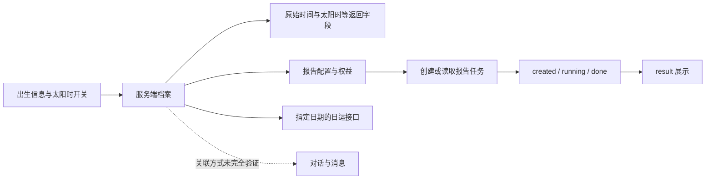

# Fatetell：可观察机制与后台未知边界

目标：https://web.fatetell.com/fate 。日期 2026-09-23。实际使用 reverse-craft R3 / web-api-identity，主代理串行；真实浏览器为 browser67，静态源码读取为 browser67-backed js-reverse。不是“复刻成功”声明。

## 证据与机制

| 观察 | 证据层 | 能支持的结论 |
|---|---|---|
| 页面有日运、命书、年运、命盘分析/对话入口 | live DOM | 分离本命、时序内容与问答体验 |
| 档案表单代码提交 birthtime、birthplace、gender、language、use_true_solar_time | 静态客户端 | 出生信息与太阳时选项进入服务端档案链路 |
| 显示代码分别读取 birthday、true_solar_time | 静态客户端 | 原始时间与太阳时是不同字段；不证明具体校时公式 |
| 日运请求路径 /api/v3/fatebook/day-yun，参数名含 archive_id/date_time/language | passive resource paths + client | 日运依附出生档案和目标日期；请求成功与响应内容未核验 |
| 命书状态 created/running/done，代码按购买/解锁状态读取 result 或创建任务后轮询 | 静态客户端 | 报告是有状态的服务端生成/存取工作流 |
| 对话客户端有 /api/v3/conversations 和 messages 读取方法 | 静态客户端与被动路径 | 问答以对话/消息组织；模型和提示词未知 |

INFERRED：稳定的出生档案支撑不同时间粒度的内容，模型式报告与交互问答位于计算/资料之上。UNVERIFIED：四柱和校时究竟由哪个后端库计算，旺衰/用神算法，提示词、检索知识库、模型、缓存键及内容质量。客户端未显示的内容不得补写为“核心算法”。

whoami 采纳：原始/校正资料分离，命盘稳定标识，本命事实与流年分层，报告和追问绑定同一资料。whoami 不连接该站 API，不复制页面资产或私有提示词，也不继承“不知时辰填中午”的文案建议。

## 导航副作用与证据限制

原以页面读取为目的进入 /archive/newversion 后，发现页面 on-mount 自动触发报告配置与 free-preview 请求。被动资源记录显示两次 free-preview 和 detail 路径；客户端代码解释了这一分支。发现后立即 finalize 标签页，停止在线操作。没有点击购买或主动编辑档案，但不能声称完全没有外部写入：自动预览是否成功及是否有权益变化未核验。没有尝试删除/回滚未知服务端产物。

今后不能把这条页面导航归为纯只读。先静态核验生命周期，有生成副作用的页面须在具体操作授权后再进入。

未做 clean-baseline 报告生成/输入输出重放，因此证据仅支持客户端编排研究。可复现核对方式是对已保全的去敏客户端片段定位字段、状态与分支；不重复在线访问触发生成。

## 取证交付

Case：`20260923T024551Z-whoami-fatetell-mechanism-study-e78f`。
位置：`~/.reverse-craft/runs/20260923T024551Z-whoami-fatetell-mechanism-study-e78f/`。
E-0001：3232 bytes，SHA-256 `162d089a93bab3883296c631fb0f9db8a61f7c2c2bdc14e8582b16e9df3755bc`；F-0001 supported。证据无 Cookie、凭据、账户邮箱、档案 ID 或私人报告正文。
Case validate：1 evidence、1 finding、0 errors。Browser finalize：本次执行关闭并验证 1 个 managed tab，errors=0；未关闭用户页面。

2026-09-23 后续：原 case 离线完整性校验再次通过；本轮未新增在线证据。具体下一阶段见 [有界实验方案](fatetell-experiments.md)。
